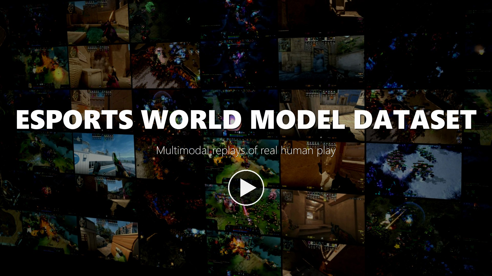

# Esports World Model Dataset

[English](README.md) | [简体中文](README.zh-CN.md) | [ModelScope](https://www.modelscope.cn/datasets/meisah111/Esports_world_model_datasets)

**Authors:** Weiyu Ma, Zeyuan Gong<sup>1</sup>, Xuhui Liu<sup>1</sup>, Wenxuan Zhang<sup>1</sup>, Jian Ding<sup>1</sup>, Xinyu Cui<sup>2</sup>, Mohamed Elhoseiny<sup>1</sup>, Jian Zhao<sup>3,*</sup>

<sup>1</sup>King Abdullah University of Science and Technology (KAUST) &nbsp; <sup>2</sup>Institute of Automation, Chinese Academy of Sciences &nbsp; <sup>3</sup>Beijing Zhongguancun Academy & Zhongguancun Institute of Artificial Intelligence &nbsp; <sup>*</sup>Corresponding author: [jianzhao@zgci.ac.cn](mailto:jianzhao@zgci.ac.cn)

[](https://www.modelscope.cn/datasets/meisah111/Esports_world_model_datasets/resolve/master/promo/promo_2160p.mp4)

Promo video (64 s): [4K](https://www.modelscope.cn/datasets/meisah111/Esports_world_model_datasets/resolve/master/promo/promo_2160p.mp4) · [1080p](docs/assets/promo_1080p.mp4) &nbsp;|&nbsp; Paper: [PDF](paper/Esports_World_Model_Dataset.pdf)

> **Academic research and non-commercial use only.** Commercial-use inquiries should be sent to [sc2meisah@gmail.com](mailto:sc2meisah@gmail.com). This dataset contains footage rendered from game replays and game data. All related copyrights and trademarks belong to Blizzard Entertainment (StarCraft II) and Valve Corporation (Dota 2, Counter-Strike 2). Read the [license and copyright notice](#license-and-copyright-notice) before use.

The dataset decodes replays of real players into multi-view player videos for **StarCraft II (RTS), Dota 2 (MOBA), and Counter-Strike 2 (FPS)**, time-aligned with game actions, engine state, and events. It is intended for research on action-conditioned world models, multi-view consistency, partial observability, and video understanding.

## Scale

| | StarCraft II | Dota 2 | Counter-Strike 2 |
|---|---:|---:|---:|
| Genre / format | RTS / 1v1 | MOBA / 5v5 | FPS / 5v5 |
| Matches | 2,320 indexed | 303 | 50 |
| Gameplay hours | 430.8 h | 282.8 h | 34.8 h |
| Player-view hours | 861.5 h | 2,827.9 h | 138.4 h |
| Views | 2 per match | up to 10 per match | 7,623 round-level POV clips |
| Structured data | ~69.5M trajectory steps | ~8.4B state changes | 64 tick/s replay aligned with 16 FPS video |

Total: 2,673 matches/maps, 748.4 gameplay hours, ~3,828 player-view hours. Gameplay hours count each match once; player-view hours sum over all views.

The online release keeps growing; trust the metadata shipped with each subset. SC2 release metadata indexes 2,320 games; standard release `v1.0.0` marks 2,314 as training-ready and contains 4,628 completed views (see [`meta/info.json`](https://www.modelscope.cn/datasets/meisah111/Esports_world_model_datasets/resolve/master/esports_world_model_full_20260901/starcraft2/publish/standard/v1.0.0/meta/info.json)). The CS2 training-ready subset has 7,341 paired video/state clips, 134.7 h (see the [scale report](https://www.modelscope.cn/datasets/meisah111/Esports_world_model_datasets/resolve/master/esports_world_model_full_20260901/counter_strike2/reports/dataset_scale_summary.md)).

### Player-view examples

| StarCraft II | Dota 2 | Counter-Strike 2 |
|---|---|---|
|  |  |  |

## Layout

```text
esports_world_model_full_20260901/
├── starcraft2/
│   ├── publish/standard/v1.0.0/   # Recommended: Parquet trajectories + MP4 + metadata
│   ├── publish/index/             # File index and statistics
│   └── dataset_prep/              # Format spec and scripts
├── dota2/
│   ├── gdrive/matches/<match_id>/ # One package per match
│   └── gdrive2/matches/           # Additional packages (overlapping match IDs)
└── counter_strike2/
    ├── extracted/                 # By match / round / player
    └── reports/                   # Inventories and quality reports
```

The repository also holds source archives and intermediate files. Download what you need; do not pull the whole repository recursively.

## Formats

### StarCraft II


*The diagram shows raw decoder outputs; the standard release uses the Parquet layout below.*

Each replay is re-run in the engine build that matches it, with fog of war on, once per player, sampled along `game_loop`.

```text
standard/v1.0.0/
├── meta/        # info.json, schema.json, games/players/views/clips/files.parquet
├── data/build=<b>/context=<c>/split=<s>/<game_id>.p<i>.trajectory.parquet
└── videos/build=<b>/context=<c>/split=<s>/<game_id>.p<i>.{rgb,minimap}.mp4
```

One row per step. Main fields: `step_index`, `game_loop`, `timestamp_s`, `frame_index`, `observation` (camera, resources, score, upgrades, visible units), `action` (camera moves and unit commands), `is_first/is_last/is_terminal/is_truncated`, `reward_terminal` (win +1 / loss −1).

- `step[t].action` is the action taken between `observation[t]` and `observation[t+1]`. It is already aligned; do not shift it again. Actions before the first frame are in `views.reset_actions`.
- Visibility is the game engine's fog-of-war state, not inclusion in the current camera window. A `visible` enemy is currently observable under the engine rules. A `snapshot` is the engine's remembered record of a previously seen enemy structure, containing its last-seen type and position rather than current ground truth.
- Live units co-observed by both players have shared entity tags and can be matched across views. Snapshots are not joined across views by tag. Unit and ability IDs depend on the game build.
- Both views of a game are always in the same split. Full spec: [STANDARD_RELEASE.md](https://www.modelscope.cn/datasets/meisah111/Esports_world_model_datasets/resolve/master/esports_world_model_full_20260901/starcraft2/dataset_prep/STANDARD_RELEASE.md).

### Dota 2


`.dem` replays are parsed into state changes and events, and a video is rendered for each player slot.

```text
matches/<match_id>/
├── match.json          # Match info, tick rate, per-slot files, missing assets
├── delta.parquet       # Engine state deltas (not full snapshots)
├── messages.parquet    # Events / messages
└── slot00/ … slot09/
    ├── video.mp4
    ├── alignment.parquet       # Video frame ↔ replay tick
    └── frame_actions.parquet   # Player actions per frame
```

Frame rate and frame-to-tick ratio can differ between matches, so use each package's `alignment.parquet`. `gdrive` and `gdrive2` share some match IDs; deduplicate before counting or splitting.

### Counter-Strike 2


Replays are parsed with `demoparser2`, first-person video is recorded with `csdm` + FFmpeg, and output is split by round and player.

- Match level: `metadata.json`, `player_states.parquet`, `player_inputs.parquet`, event tables
- Round / player level: `video.mp4`, `state.parquet`, `events.parquet`
- 16 FPS video against 64 tick/s replay (1 frame = 4 ticks); account for clip start offsets and death truncation. Not every round has all 10 views. Filter using the quality categories in `reports/`.

## Quick start

```bash
pip install modelscope pandas pyarrow
```

```python
from modelscope.hub.file_download import dataset_file_download
import pandas as pd

REPO = "meisah111/Esports_world_model_datasets"
SC2 = "esports_world_model_full_20260901/starcraft2/publish/standard/v1.0.0"

def get(path):
    return dataset_file_download(REPO, file_path=f"{SC2}/{path}")

views = pd.read_parquet(get("meta/views.parquet"))
view = views[views["split"] == "train"].iloc[0]

traj = pd.read_parquet(get(view["data_path"]),
                       columns=["step_index", "game_loop", "observation", "action"])
print(traj.head())
# Video: get(view["rgb_path"]), get(view["minimap_path"])
```

For Dota 2, start with `match.json`; for CS2, start with the inventories in `reports/`.

## Usage notes

- **Avoid split leakage:** keep all views, rounds, and clips of one match in the same split.
- **Separate visible and privileged information:** global engine state may be used as supervision, but not as model input in partial-observability evaluation.
- **Use complete pairs only:** check that video and structured data are both present.
- **No shared action space:** each game's actions are its own commands / engine inputs; define your own mapping for cross-game use.
- **Privacy:** the SC2 standard release anonymizes non-professional players. Raw files of other games are not processed the same way. Do not use the data to identify or track individual players.

## License and copyright notice

1. **Academic research and non-commercial use only.** The parts of this repository we produced (decoded structured data, alignment tables, metadata, scripts, and documentation) are released under [CC BY-NC 4.0](https://creativecommons.org/licenses/by-nc/4.0/). Commercial use without prior permission is prohibited, including commercial products or services, training commercial models, and paid distribution or resale. For commercial-use inquiries, contact [sc2meisah@gmail.com](mailto:sc2meisah@gmail.com).
2. **Game content belongs to its owners.** Video footage, game assets, unit/hero/map names, replay files, and related trademarks belong to Blizzard Entertainment and Valve Corporation respectively. This dataset is not affiliated with, endorsed by, or licensed by these companies. We claim no rights to this content, and CC BY-NC 4.0 does not cover it.
3. **Follow upstream terms.** Users must also comply with each game's end-user license agreement, terms of service, and the terms of the replay sources (e.g., Blizzard's replay pack license). Where upstream terms are stricter, they prevail.
4. **No redistribution of raw game content.** Do not repackage and publicly redistribute the videos or replays. Limited screenshots or clips used for illustration in papers and reports are excepted.
5. **Disclaimer.** The data is provided "as is", without warranty of any kind.
6. **Rights holders.** If you believe any content here infringes your rights, contact us at the email below and we will promptly address or remove it.

## Citation

```bibtex
@misc{esports_world_model_dataset,
  author       = {Ma, Weiyu and Gong, Zeyuan and Liu, Xuhui and Zhang, Wenxuan and Ding, Jian and Cui, Xinyu and Elhoseiny, Mohamed and Zhao, Jian},
  title        = {Esports World Model Dataset},
  howpublished = {ModelScope dataset repository},
  url          = {https://www.modelscope.cn/datasets/meisah111/Esports_world_model_datasets},
  note         = {Please state the subset and revision used}
}
```

## Contact

Weiyu Ma, [sc2meisah@gmail.com](mailto:sc2meisah@gmail.com); corresponding author Jian Zhao, [jianzhao@zgci.ac.cn](mailto:jianzhao@zgci.ac.cn); or the ModelScope dataset discussion page.
