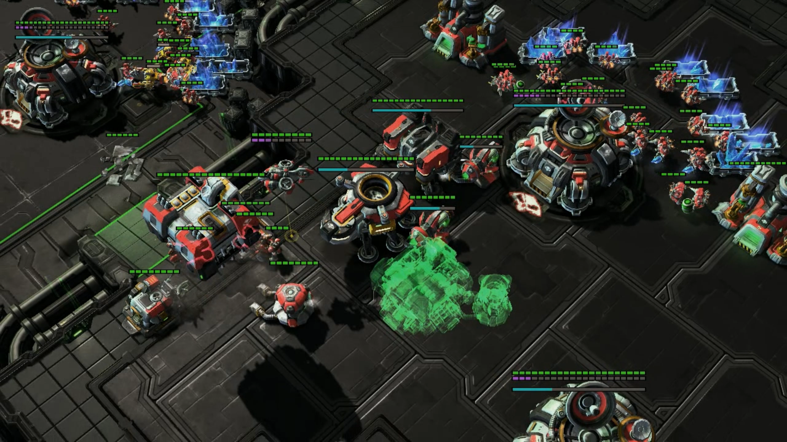
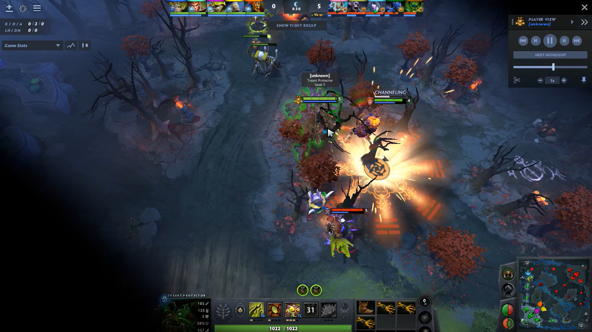
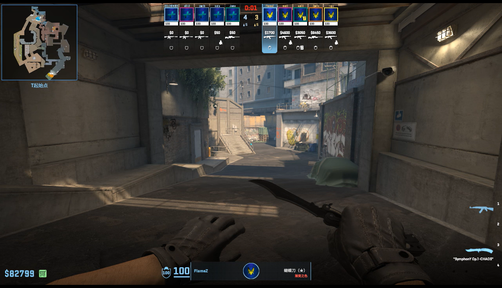
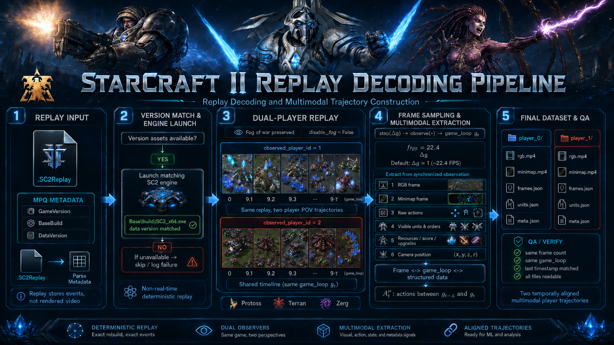
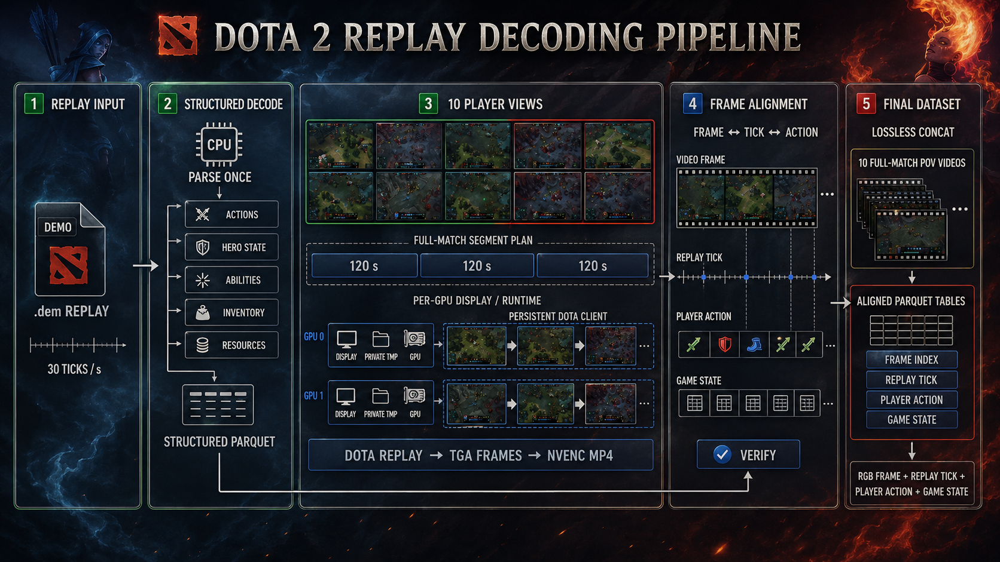
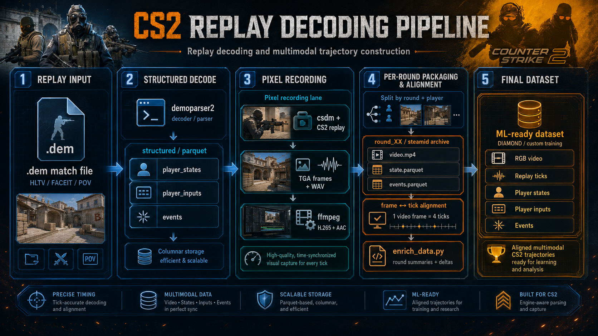

# 电子竞技世界模型数据集

[English](README.md) | [简体中文](README.zh-CN.md) | [ModelScope](https://www.modelscope.cn/datasets/meisah111/Esports_world_model_datasets)

> **仅限非商业科研使用。** 本数据集包含由游戏回放渲染得到的画面及游戏数据，相关版权与商标归 Blizzard Entertainment（StarCraft II）和 Valve Corporation（Dota 2、Counter-Strike 2）所有。使用前请阅读文末[许可与版权声明](#许可与版权声明)。

本数据集解码真实玩家的比赛回放，提供 **StarCraft II（RTS）、Dota 2（MOBA）和 Counter-Strike 2（FPS）** 的多视角玩家视频，并与游戏动作、引擎状态和事件在时间上对齐。适用于动作条件世界模型、多视角一致性、部分可观测推理和视频理解等研究。

## 数据规模

| | StarCraft II | Dota 2 | Counter-Strike 2 |
|---|---:|---:|---:|
| 类型 / 对阵 | RTS / 1v1 | MOBA / 5v5 | FPS / 5v5 |
| 对局数 | 2,145 | 273 | 50 |
| 比赛时长 | 395.8 h | 195.5 h | 34.8 h |
| 玩家视角视频时长 | 791.5 h | 1,955.0 h | 138.4 h |
| 视角 | 每局 2 个 | 每局最多 10 个 | 7,623 个回合级 POV 片段 |
| 结构化数据 | 约 5,900 万轨迹步 | 约 77 亿条状态变化、2.2 亿条事件 | 64 tick/s 回放与 16 FPS 视频对齐 |

合计 2,468 局、626.1 小时比赛、约 2,885 小时玩家视角视频。比赛时长每局只计一次，视角时长对所有视角求和。

线上版本持续更新，以各子集自带的元数据为准：SC2 标准版 `v1.0.0` 含 2,314 局可训练对局、4,628 个视角（见 [`meta/info.json`](https://www.modelscope.cn/datasets/meisah111/Esports_world_model_datasets/resolve/master/esports_world_model_full_20260901/starcraft2/publish/standard/v1.0.0/meta/info.json)）；CS2 训练可用子集含 7,341 个视频/状态配对片段、134.7 小时（见[规模报告](https://www.modelscope.cn/datasets/meisah111/Esports_world_model_datasets/resolve/master/esports_world_model_full_20260901/counter_strike2/reports/dataset_scale_summary.md)）。

### 玩家视角示例

| StarCraft II | Dota 2 | Counter-Strike 2 |
|---|---|---|
|  |  |  |

## 目录结构

```text
esports_world_model_full_20260901/
├── starcraft2/
│   ├── publish/standard/v1.0.0/   # 推荐使用：Parquet 轨迹 + MP4 视频 + 元数据
│   ├── publish/index/             # 文件索引与统计
│   └── dataset_prep/              # 格式说明与处理脚本
├── dota2/
│   ├── gdrive/matches/<match_id>/ # 按比赛打包
│   └── gdrive2/matches/           # 补充数据包（与上者有重复比赛 ID）
└── counter_strike2/
    ├── extracted/                 # 按比赛 / 回合 / 玩家组织
    └── reports/                   # 清单与质量报告
```

仓库同时包含源压缩包和中间产物，请按需下载，不要递归拉取整个仓库。

## 各游戏数据格式

### StarCraft II



*图中为原始解码输出；标准版采用下方的 Parquet 布局。*

使用与回放版本匹配的游戏引擎、保留战争迷雾，分别从两名玩家视角重放，并沿 `game_loop` 采样。

```text
standard/v1.0.0/
├── meta/        # info.json、schema.json、games/players/views/clips/files.parquet
├── data/build=<b>/context=<c>/split=<s>/<game_id>.p<i>.trajectory.parquet
└── videos/build=<b>/context=<c>/split=<s>/<game_id>.p<i>.{rgb,minimap}.mp4
```

每行一个时间步，主要字段：`step_index`、`game_loop`、`timestamp_s`、`frame_index`、`observation`（镜头、资源、分数、升级、可见单位）、`action`（镜头移动与单位指令）、`is_first/is_last/is_terminal/is_truncated`、`reward_terminal`（胜 +1 / 负 −1）。

- `step[t].action` 是从 `observation[t]` 到 `observation[t+1]` 之间的动作，已对齐，无需再平移。首帧前的动作在 `views.reset_actions` 中。
- 观测仅包含该玩家可见的信息；实体 tag 不能跨视角匹配；单位/技能 ID 与游戏 build 相关。
- 同一局的两个视角始终在同一 split 中。完整约定见 [STANDARD_RELEASE.md](https://www.modelscope.cn/datasets/meisah111/Esports_world_model_datasets/resolve/master/esports_world_model_full_20260901/starcraft2/dataset_prep/STANDARD_RELEASE.md)。

### Dota 2



解析 `.dem` 回放得到状态变化与事件，并为每个玩家槽位渲染视频。

```text
matches/<match_id>/
├── match.json          # 比赛信息、tick rate、各槽位文件及缺失项
├── delta.parquet       # 引擎状态增量（非完整快照）
├── messages.parquet    # 事件 / 消息
└── slot00/ … slot09/
    ├── video.mp4
    ├── alignment.parquet       # 视频帧 ↔ 回放 tick
    └── frame_actions.parquet   # 每帧玩家动作
```

不同比赛的帧率和帧/tick 比例可能不同，请使用各自的 `alignment.parquet`。`gdrive` 与 `gdrive2` 存在重复比赛 ID，统计和划分前请先去重。

### Counter-Strike 2



使用 `demoparser2` 解析回放，通过 `csdm` + FFmpeg 录制玩家第一人称视频，按回合和玩家切分。

- 比赛级：`metadata.json`、`player_states.parquet`、`player_inputs.parquet`、事件表
- 回合/玩家级：`video.mp4`、`state.parquet`、`events.parquet`
- 16 FPS 视频对应 64 tick/s 回放（1 帧 = 4 tick），需结合片段起点和死亡截断对齐。并非每个回合都有 10 个完整视角，请依据 `reports/` 中的质量分类筛选。

## 快速开始

```bash
pip install modelscope pandas pyarrow
```

```python
from modelscope.hub.file_download import dataset_file_download
import pandas as pd

REPO = "meisah111/Esports_world_model_datasets"
SC2 = "esports_world_model_full_20260901/starcraft2/publish/standard/v1.0.0"

def get(path):
    return dataset_file_download(REPO, file_path=f"{SC2}/{path}")

views = pd.read_parquet(get("meta/views.parquet"))
view = views[views["split"] == "train"].iloc[0]

traj = pd.read_parquet(get(view["data_path"]),
                       columns=["step_index", "game_loop", "observation", "action"])
print(traj.head())
# 视频：get(view["rgb_path"])、get(view["minimap_path"])
```

Dota 2 建议先读 `match.json`，CS2 建议先读 `reports/` 下的清单。

## 使用注意

- **防止划分泄漏：** 同一比赛的所有视角、回合和片段应放在同一划分。
- **区分可见与特权信息：** 引擎全局状态可用于监督，但在部分可观测评测中不应作为模型输入。
- **只用完整配对样本：** 使用前核对视频与结构化数据是否齐全。
- **动作空间不统一：** 三款游戏的动作是各自的游戏指令/引擎输入，跨游戏使用需自行定义映射。
- **隐私：** SC2 标准版已对非职业玩家身份脱敏；其他游戏的原始文件未做同等处理，请勿用于识别或追踪个人玩家。

## 许可与版权声明

1. **仅限非商业科研用途。** 本仓库中由我们产出的部分（解码后的结构化数据、对齐表、元数据、脚本与文档）以 [CC BY-NC 4.0](https://creativecommons.org/licenses/by-nc/4.0/deed.zh-hans) 发布。禁止用于任何商业目的，包括但不限于商业产品或服务、商业模型训练、付费分发或转售。
2. **游戏内容版权归原权利人。** 视频画面、游戏素材、单位/英雄/地图名称、回放文件及相关商标分别归 Blizzard Entertainment 和 Valve Corporation 所有。本数据集与上述公司无关联，也未获其认可或授权。我们不对上述内容主张任何权利，CC BY-NC 4.0 不覆盖这些内容。
3. **遵守上游条款。** 使用者须同时遵守各游戏的最终用户许可协议、服务条款以及回放来源（如 Blizzard 回放包许可）的相关规定；若上游条款更严格，以上游条款为准。
4. **禁止再分发原始游戏内容。** 请勿将视频或回放单独打包公开再分发。论文、报告中少量引用截图或片段用于学术说明的情况除外。
5. **免责。** 数据按“现状”提供，不作任何明示或暗示的保证。
6. **权利人联系。** 如权利人认为本数据集的任何内容侵犯其权益，请通过下方邮箱联系，我们将及时处理或下架相关内容。

## 引用

```bibtex
@misc{esports_world_model_dataset,
  author       = {Ma, Weiyu},
  title        = {Esports World Model Dataset},
  howpublished = {ModelScope dataset repository},
  url          = {https://www.modelscope.cn/datasets/meisah111/Esports_world_model_datasets},
  note         = {Please state the subset and revision used}
}
```

## 联系方式

[sc2meisah@gmail.com](mailto:sc2meisah@gmail.com)，或在 ModelScope 数据集讨论区留言。
